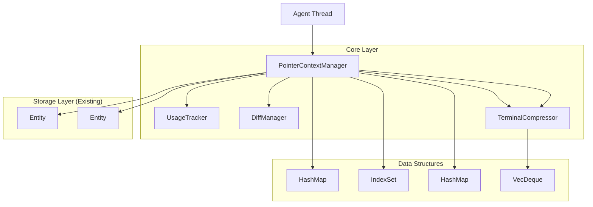

# Pointer-Based Context Manager - Technical Architecture Document

## 1. Architecture Design



## 2. Technology Description

- **Language**: Rust 2021 Edition
- **Core Framework**: GPUI (Zed's UI framework)
- **Async Runtime**: Built on GPUI's async task system
- **Data Structures**: std::collections (HashMap, VecDeque), indexmap::IndexSet
- **Memory Management**: Rust ownership system with Entity<T> and WeakEntity<T>
- **Error Handling**: anyhow::Result for error propagation
- **Serialization**: serde for persistence

## 3. Core Components

### 3.1 PointerContextManager Structure

```rust
use gpui::{Entity, WeakEntity, Context, Task, EventEmitter};
use collections::{HashMap, VecDeque};
use indexmap::IndexSet;
use anyhow::Result;
use std::time::{Duration, Instant};
use std::path::PathBuf;

pub struct PointerContextManager {
    // Configuration
    config: ContextManagerConfig,
    
    // Core storage (existing Zed components)
    context_store: Entity<ContextStore>,
    thread_store: Option<WeakEntity<ThreadStore>>,
    project: WeakEntity<Project>,
    
    // Memory management
    usage_tracker: UsageTracker,
    token_counter: TokenCounter,
    
    // Content management
    diff_manager: DiffManager,
    terminal_compressor: TerminalCompressor,
    
    // Active context tracking
    active_refs: IndexSet<AgentContextKey>,
    loaded_content: HashMap<ContextId, LoadedContent>,
    
    // Budget tracking
    current_token_count: usize,
    budget_allocations: HashMap<ContentType, usize>,
}

#[derive(Clone)]
pub struct ContextManagerConfig {
    pub max_tokens: usize,
    pub safety_threshold: f32,
    pub half_life_minutes: u64,
    pub terminal_compression_after: usize,
    pub per_type_budgets: HashMap<ContentType, f32>,
    pub diff_ttl: HashMap<EditStrategy, Duration>,
}

#[derive(Debug, Clone, PartialEq, Eq, Hash)]
pub enum ContentType {
    Files,
    Terminal,
    Diffs,
    Tasks,
}

#[derive(Debug, Clone)]
pub enum RepresentationLevel {
    Full,
    Symbols,
    Headers,
    Diff,
    Pointer,
}
```

### 3.2 Usage Tracking System

```rust
pub struct UsageTracker {
    stats: HashMap<ContextId, UsageStats>,
    half_life: Duration,
    last_decay: Instant,
}

#[derive(Debug, Clone)]
pub struct UsageStats {
    pub last_used: Instant,
    pub use_count: u32,
    pub priority: f64,
    pub content_type: ContentType,
}

impl UsageTracker {
    pub fn decay_stats(&mut self, half_life_minutes: u64) {
        let now = Instant::now();
        let half_life = Duration::from_secs(half_life_minutes * 60);
        
        for stats in self.stats.values_mut() {
            let age = now.duration_since(stats.last_used);
            let decay_factor = 0.5_f64.powf(age.as_secs_f64() / half_life.as_secs_f64());
            
            let recency_boost = if stats.last_used > self.last_decay { 1.0 } else { 0.0 };
            let use_factor = (stats.use_count.saturating_sub(1) as f64).max(0.0);
            
            stats.priority = (use_factor * 0.4 + recency_boost * 0.6) * decay_factor;
        }
        
        self.last_decay = now;
    }
    
    pub fn update_usage(&mut self, context_id: ContextId, content_type: ContentType) {
        let stats = self.stats.entry(context_id).or_insert_with(|| UsageStats {
            last_used: Instant::now(),
            use_count: 0,
            priority: 0.0,
            content_type,
        });
        
        stats.last_used = Instant::now();
        stats.use_count = stats.use_count.saturating_add(1);
    }
}
```

### 3.3 Diff Management System

```rust
pub struct DiffManager {
    active_diffs: HashMap<PathBuf, Vec<DiffEntry>>,
    cleanup_tasks: HashMap<DiffId, Task<()>>,
}

#[derive(Debug, Clone)]
pub struct DiffEntry {
    pub id: DiffId,
    pub file_path: PathBuf,
    pub diff_content: String,
    pub strategy: EditStrategy,
    pub created_at: Instant,
    pub change_magnitude: ChangeMagnitude,
}

#[derive(Debug, Clone, PartialEq, Eq, Hash)]
pub enum EditStrategy {
    KeepBoth,
    ReplaceWithDiff,
    DiffMarkerOnly,
}

#[derive(Debug, Clone)]
pub struct ChangeMagnitude {
    pub change_percentage: f64,
    pub token_impact: f64,
    pub change_count: usize,
    pub is_structural_change: bool,
    pub contextual_factors: ContextualFactors,
}

#[derive(Debug, Clone)]
pub struct ContextualFactors {
    pub function_changes: usize,
    pub dependency_changes: usize,
    pub type_changes: usize,
    pub config_changes: usize,
    pub comment_only_changes: bool,
    pub formatting_only_changes: bool,
}

impl DiffManager {
    pub fn handle_file_edit(
        &mut self,
        file_path: PathBuf,
        old_content: &str,
        new_content: &str,
        cx: &mut Context<PointerContextManager>,
    ) -> Task<Result<Option<DiffEntry>>> {
        let diff_content = self.generate_diff(old_content, new_content);
        
        if diff_content.is_empty() {
            return Task::ready(Ok(None));
        }
        
        let magnitude = self.calculate_edit_magnitude(&diff_content, old_content);
        let strategy = self.select_edit_strategy(&magnitude);
        
        let diff_entry = DiffEntry {
            id: DiffId::new(),
            file_path: file_path.clone(),
            diff_content,
            strategy: strategy.clone(),
            created_at: Instant::now(),
            change_magnitude: magnitude,
        };
        
        // Schedule cleanup based on strategy
        let ttl = self.get_ttl_for_strategy(&strategy);
        let cleanup_task = cx.spawn({
            let diff_id = diff_entry.id;
            let file_path = file_path.clone();
            move |this, mut cx| async move {
                cx.background_executor().timer(ttl).await;
                this.update(&mut cx, |this, _| {
                    this.diff_manager.cleanup_diff(diff_id, &file_path);
                }).ok();
            }
        });
        
        self.cleanup_tasks.insert(diff_entry.id, cleanup_task);
        self.active_diffs.entry(file_path).or_default().push(diff_entry.clone());
        
        Task::ready(Ok(Some(diff_entry)))
    }
    
    fn select_edit_strategy(&self, magnitude: &ChangeMagnitude) -> EditStrategy {
        if magnitude.contextual_factors.comment_only_changes 
            || magnitude.contextual_factors.formatting_only_changes {
            return EditStrategy::ReplaceWithDiff;
        }
        
        if magnitude.change_percentage < 0.05 
            && magnitude.contextual_factors.function_changes > 0 {
            return EditStrategy::KeepBoth;
        }
        
        if magnitude.change_percentage > 0.5 
            || magnitude.is_structural_change {
            return EditStrategy::DiffMarkerOnly;
        }
        
        EditStrategy::ReplaceWithDiff
    }
}
```

### 3.4 Terminal Compression System

```rust
pub struct TerminalCompressor {
    entries: VecDeque<TerminalEntry>,
    compression_threshold: usize,
}

#[derive(Debug, Clone)]
pub struct TerminalEntry {
    pub command_id: String,
    pub command: String,
    pub output: String,
    pub is_error: bool,
    pub is_compressed: bool,
    pub timestamp: Instant,
    pub original_length: usize,
}

impl TerminalCompressor {
    pub fn add_entry(
        &mut self,
        command: String,
        output: String,
        is_error: bool,
    ) -> String {
        let command_id = format!("cmd_{}", Instant::now().elapsed().as_nanos());
        let original_length = output.len();
        
        let processed_output = if is_error {
            self.process_error_output(&output)
        } else {
            self.process_success_output(&output)
        };
        
        let entry = TerminalEntry {
            command_id: command_id.clone(),
            command,
            output: processed_output,
            is_error,
            is_compressed: processed_output.len() < original_length,
            timestamp: Instant::now(),
            original_length,
        };
        
        self.entries.push_back(entry);
        self.compress_old_entries();
        
        command_id
    }
    
    fn process_error_output(&self, output: &str) -> String {
        let lines: Vec<&str> = output.lines().collect();
        if lines.len() <= 100 {
            return output.to_string();
        }
        
        let head: Vec<&str> = lines.iter().take(30).copied().collect();
        let tail: Vec<&str> = lines.iter().rev().take(50).rev().copied().collect();
        let omitted = lines.len() - 80;
        
        format!(
            "{}\n... ({} lines omitted) ...\n{}",
            head.join("\n"),
            omitted,
            tail.join("\n")
        )
    }
    
    fn process_success_output(&self, output: &str) -> String {
        if output.len() <= 200 {
            return output.to_string();
        }
        
        let lines: Vec<&str> = output.lines().collect();
        if lines.len() <= 10 {
            return output.to_string();
        }
        
        let head = lines.iter().take(5).copied().collect::<Vec<_>>().join("\n");
        let tail = lines.iter().rev().take(5).rev().copied().collect::<Vec<_>>().join("\n");
        let omitted = lines.len() - 10;
        
        format!(
            "{}\n... ({} lines omitted; success) ...\n{}",
            head, omitted, tail
        )
    }
}
```

## 4. Integration with Existing Systems

### 4.1 ContextStore Integration

```rust
impl PointerContextManager {
    pub fn new(
        context_store: Entity<ContextStore>,
        thread_store: Option<WeakEntity<ThreadStore>>,
        project: WeakEntity<Project>,
        config: ContextManagerConfig,
    ) -> Self {
        Self {
            config,
            context_store,
            thread_store,
            project,
            usage_tracker: UsageTracker::new(Duration::from_secs(config.half_life_minutes * 60)),
            token_counter: TokenCounter::new(),
            diff_manager: DiffManager::new(),
            terminal_compressor: TerminalCompressor::new(config.terminal_compression_after),
            active_refs: IndexSet::new(),
            loaded_content: HashMap::new(),
            current_token_count: 0,
            budget_allocations: HashMap::new(),
        }
    }
    
    pub fn assemble_context(
        &mut self,
        user_message: &str,
        intent: Option<&str>,
        hard_pins: Vec<ContextId>,
        cx: &mut Context<Self>,
    ) -> Task<Result<Vec<LoadedContent>>> {
        // Decay usage statistics
        self.usage_tracker.decay_stats(self.config.half_life_minutes);
        
        // Extract references from message
        let refs = self.extract_references(user_message);
        
        // Score and prioritize references
        let mut candidates = self.score_references(&refs, intent.unwrap_or(""));
        candidates.sort_by(|a, b| b.score.partial_cmp(&a.score).unwrap_or(std::cmp::Ordering::Equal));
        
        // Budgeted assembly with degradation
        cx.spawn(|this, mut cx| async move {
            let mut loaded_content = Vec::new();
            let threshold = (this.read_with(&cx, |this, _| this.config.max_tokens)? as f32 
                * this.read_with(&cx, |this, _| this.config.safety_threshold)?) as usize;
            
            for candidate in candidates {
                let content = this.update(&mut cx, |this, cx| {
                    this.load_reference_with_level(candidate.context_id, candidate.level, cx)
                })?.await?;
                
                if let Some(content) = content {
                    let tokens = this.read_with(&cx, |this, _| {
                        this.token_counter.count_tokens(&content.text)
                    })?;
                    
                    if this.read_with(&cx, |this, _| this.current_token_count)? + tokens <= threshold {
                        this.update(&mut cx, |this, _| {
                            this.current_token_count += tokens;
                            this.usage_tracker.update_usage(candidate.context_id, content.content_type.clone());
                        })?;
                        loaded_content.push(content);
                    } else {
                        // Try degrading the representation level
                        if let Some(degraded_content) = this.update(&mut cx, |this, cx| {
                            this.try_degrade_content(candidate.context_id, candidate.level, cx)
                        })?.await? {
                            loaded_content.push(degraded_content);
                        }
                        break;
                    }
                }
            }
            
            Ok(loaded_content)
        })
    }
}
```

### 4.2 Event System Integration

```rust
pub enum ContextManagerEvent {
    ContentLoaded(ContextId),
    ContentEvicted(ContextId),
    BudgetExceeded { current: usize, limit: usize },
    DiffCreated { file_path: PathBuf, strategy: EditStrategy },
    TerminalCompressed { command_id: String, compression_ratio: f64 },
}

impl EventEmitter<ContextManagerEvent> for PointerContextManager {}

impl PointerContextManager {
    fn emit_content_loaded(&mut self, context_id: ContextId, cx: &mut Context<Self>) {
        cx.emit(ContextManagerEvent::ContentLoaded(context_id));
    }
    
    fn emit_budget_exceeded(&mut self, current: usize, limit: usize, cx: &mut Context<Self>) {
        cx.emit(ContextManagerEvent::BudgetExceeded { current, limit });
    }
}
```

## 5. Memory Management and Safety

### 5.1 Ownership Patterns

```rust
// Use Entity<T> for shared, mutable state
pub struct ContextManager {
    context_store: Entity<ContextStore>,  // Strong reference for active use
    thread_store: Option<WeakEntity<ThreadStore>>,  // Weak reference to avoid cycles
}

// Use Arc<T> for immutable shared data
#[derive(Clone)]
pub struct LoadedContent {
    pub text: Arc<str>,  // Immutable shared text content
    pub metadata: ContentMetadata,
}

// Use Cow<T> for potentially borrowed data
use std::borrow::Cow;

pub fn process_content<'a>(content: Cow<'a, str>) -> String {
    match content {
        Cow::Borrowed(s) => s.to_uppercase(),  // No allocation needed
        Cow::Owned(s) => s.to_uppercase(),     // Already owned
    }
}
```

### 5.2 Error Handling Strategy

```rust
use anyhow::{Result, Context as AnyhowContext};
use thiserror::Error;

#[derive(Error, Debug)]
pub enum ContextManagerError {
    #[error("Context not found: {context_id:?}")]
    ContextNotFound { context_id: ContextId },
    
    #[error("Budget exceeded: {current} > {limit}")]
    BudgetExceeded { current: usize, limit: usize },
    
    #[error("Failed to load content: {source}")]
    ContentLoadError { source: anyhow::Error },
    
    #[error("Diff generation failed for {file_path}")]
    DiffGenerationError { file_path: PathBuf },
}

impl PointerContextManager {
    pub fn load_context(
        &mut self,
        context_id: ContextId,
        cx: &mut Context<Self>,
    ) -> Task<Result<LoadedContent, ContextManagerError>> {
        cx.spawn(|this, mut cx| async move {
            let context_handle = this.read_with(&cx, |this, _| {
                this.active_refs.iter()
                    .find(|key| key.as_ref().id() == context_id)
                    .map(|key| key.as_ref().clone())
            })?
            .ok_or(ContextManagerError::ContextNotFound { context_id })?;
            
            // Load content with proper error context
            let content = this.update(&mut cx, |this, cx| {
                this.context_store.update(cx, |store, cx| {
                    // Existing ContextStore loading logic
                    store.load_context(&context_handle, cx)
                })
            })?
            .await
            .with_context(|| format!("Failed to load context {context_id:?}"))
            .map_err(|source| ContextManagerError::ContentLoadError { source })?;
            
            Ok(content)
        })
    }
}
```

## 6. Implementation Roadmap

### Phase 1: Core Infrastructure (2-3 weeks)
1. **PointerContextManager Structure**: Implement basic struct with configuration
2. **UsageTracker**: Implement exponential decay and priority scoring
3. **TokenCounter**: Integrate with existing token counting systems
4. **Basic Integration**: Connect with existing ContextStore and ThreadStore

### Phase 2: Content Management (2-3 weeks)
1. **Multi-level Representations**: Implement representation degradation system
2. **Budgeted Assembly**: Implement token-aware context assembly
3. **Reference Extraction**: Implement pattern matching for context references
4. **Event System**: Implement EventEmitter integration

### Phase 3: Advanced Features (3-4 weeks)
1. **DiffManager**: Implement intelligent diff handling with TTL
2. **TerminalCompressor**: Implement error-biased compression
3. **Memory Optimization**: Implement eviction policies and budget enforcement
4. **Performance Tuning**: Optimize for large codebases

### Phase 4: Integration and Testing (2-3 weeks)
1. **Agent Integration**: Connect with existing agent system
2. **Persistence**: Implement state serialization/deserialization
3. **Monitoring**: Add metrics and debugging interfaces
4. **Testing**: Comprehensive unit and integration tests

### Integration Points with Existing Code

```rust
// In crates/agent/src/context_store.rs
impl ContextStore {
    pub fn with_pointer_manager(
        &mut self,
        pointer_manager: Entity<PointerContextManager>,
    ) {
        // Integration logic
    }
}

// In crates/agent/src/thread.rs
impl Thread {
    pub fn assemble_context_with_pointer_manager(
        &self,
        pointer_manager: &Entity<PointerContextManager>,
        cx: &mut Context<Thread>,
    ) -> Task<Result<Vec<LoadedContent>>> {
        // Use pointer manager for context assembly
    }
}

// In crates/agent_ui/src/active_thread.rs
impl ActiveThread {
    fn update_context_with_pointer_manager(
        &mut self,
        pointer_manager: &Entity<PointerContextManager>,
        cx: &mut Context<Self>,
    ) {
        // Update UI based on pointer manager state
    }
}
```

This architecture leverages Rust's ownership system and Zed's existing patterns to provide memory-safe, efficient context management while maintaining compatibility with the current agent system.
