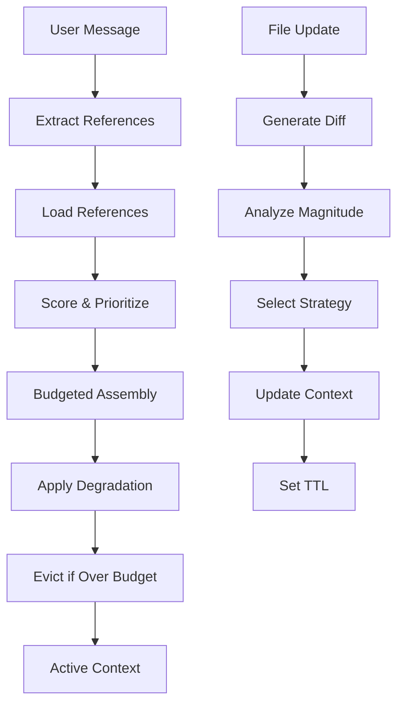

# Pointer-Based Context Manager - Product Requirements Document

## 1. Product Overview

The Pointer-Based Context Manager is a Rust-based advanced memory system for Zed's AI agents that provides intelligent context assembly, dynamic content degradation, and efficient token budget management. It integrates with Zed's existing agent architecture using GPUI's Entity<T> patterns and leverages Rust's ownership model for memory-safe context handling.

The system enables Zed's agents to maintain long-term memory across conversations, intelligently prioritize content based on usage patterns, and dynamically adapt context representation to fit within computational constraints while seamlessly integrating with existing ContextStore/ThreadStore systems.

## 2. Core Features

### 2.1 User Roles

This system operates at the infrastructure level and does not require distinct user roles. All interactions are programmatic through the agent system.

### 2.2 Feature Module

Our Rust-based context management system consists of the following main components:

1. **PointerContextManager Core**: Entity<T>-based architecture with integration to existing ContextStore/ThreadStore and async Task<T> operations
2. **Context Assembly Engine**: Intelligent budgeted assembly with multi-level representations using Rust ownership patterns and degradation strategies
3. **Usage Analytics**: Exponential decay tracking with HashMap/IndexSet and priority scoring for content relevance
4. **Diff Management**: Smart file edit handling with async TTL-based lifecycle and strategy selection using Result<T,E>
5. **Terminal Compression**: Error-biased compression with VecDeque, head/tail preservation for command outputs
6. **Memory Optimization**: Token counting with atomic counters, budget allocation, and eviction policies with memory-safe ownership

### 2.3 Page Details

| Component | Module Name | Feature Description |
|-----------|-------------|--------------------|
| PointerContextManager | Core Architecture | Implement Entity<PointerContextManager> with integration to existing ContextStore/ThreadStore, async Task<T> operations, WeakEntity references |
| Content Store | File Management | Store file content with headers, tokens, metadata, and diff tracking. Support versioning and change detection |
| Content Store | Terminal Management | Compress terminal outputs with error preservation. Maintain command history with smart compression |
| Content Store | Task Management | Track task states, descriptions, and context with timestamp-based updates |
| Context Assembly | Multi-level Representation | Provide 5 levels: full, symbols, headers, diff, pointer. Enable dynamic degradation under budget constraints |
| Context Assembly | Budgeted Assembly | Score references by recency, frequency, and relevance. Assemble context within token limits |
| Context Assembly | Reference Loading | Load and unload references dynamically. Track usage statistics and update priorities |
| Usage Analytics | Exponential Decay | Apply time-based decay to usage statistics. Calculate priority scores with recency and frequency weighting |
| Usage Analytics | Scoring Algorithm | Score references using recency (45%), frequency (35%), type weight (20%), and intent relevance |
| Diff Management | Edit Strategy Selection | Choose between KEEP_BOTH, REPLACE_WITH_DIFF, DIFF_MARKER_ONLY based on change magnitude |
| Diff Management | Change Analysis | Analyze structural changes, contextual factors, memory efficiency, and context preservation |
| Diff Management | TTL Lifecycle | Manage diff lifecycle with time-to-live and superseding logic. Clean up stale diffs automatically |
| Terminal Compression | Error-biased Processing | Preserve error context with head/tail strategy. Compress successful outputs aggressively |
| Terminal Compression | Ring Buffer Management | Maintain recent terminal entries with automatic compression of older entries |
| Memory Optimization | Token Budget Management | Enforce token limits with safety thresholds. Degrade before dropping content |
| Memory Optimization | Eviction Policies | Implement two-phase eviction: representation degradation then reference removal |

## 3. Core Process

### Main Context Assembly Flow (Rust Implementation)

1. **Turn Initialization**: Decay usage statistics using Duration calculations based on configurable half-life (default 45 minutes)
2. **Message Processing**: Extract references using Rust pattern matching from user message and add to IndexSet<AgentContextKey>
3. **Reference Loading**: Load referenced content with async Task<Result<LoadedContent>> and update usage statistics
4. **Context Assembly**: Score and prioritize references using HashMap<ContextId, UsageStats>, apply budgeted assembly with degradation
5. **Budget Enforcement**: Evict content using two-phase strategy with Result<T, ContextManagerError> handling

### File Edit Handling Flow (Rust Implementation)

1. **Change Detection**: Generate diff when file content is updated using PathBuf and existing Zed file watching
2. **Magnitude Analysis**: Calculate change percentage, token impact, and ContextualFactors using Rust algorithms
3. **Strategy Selection**: Choose EditStrategy enum variant based on change magnitude and efficiency metrics
4. **Context Update**: Apply selected strategy (KeepBoth, ReplaceWithDiff, DiffMarkerOnly) with ownership patterns
5. **TTL Management**: Set Duration-based time-to-live for diff content and schedule async cleanup Task<()>

## 4. User Interface Design

### 4.1 Design Style

As an infrastructure component, this system has no direct user interface. However, debugging and monitoring interfaces should follow these principles:

- **Primary Colors**: Zed theme colors for consistency, system blue (#0066CC) for normal operations, amber (#FF9900) for warnings, red (#CC0000) for errors
- **Typography**: Zed's default font stack, monospace fonts for code and logs, consistent sizing with editor
- **Layout Style**: Integrated with Zed's panel system, GPUI-based layouts for different metrics and status indicators
- **Data Visualization**: GPUI line charts for usage trends, bar charts for token distribution, heat maps for reference activity

### 4.2 Monitoring Dashboard Design

| Component | Module Name | UI Elements |
|-----------|-------------|-------------|
| PointerContextManager | Status Panel | GPUI real-time token usage gauge, active references count, memory efficiency metrics integrated with Zed panels |
| UsageTracker | Priority Heatmap | GPUI visual representation of reference scores with color-coded priority levels using Zed's color system |
| Context Assembly | Budget Visualization | GPUI stacked bar chart showing token allocation by ContentType enum (files, terminal, diffs, tasks) |
| DiffManager | Strategy Distribution | GPUI pie chart showing distribution of EditStrategy enum variants over time |
| Performance Metrics | Efficiency Graphs | GPUI line charts for context quality, memory efficiency, and assembly time trends with Zed styling |

### 4.3 Responsiveness

Monitoring interfaces should be desktop-first with responsive design for tablet viewing. Touch interaction is not a primary concern as this is primarily a developer/administrator tool.
